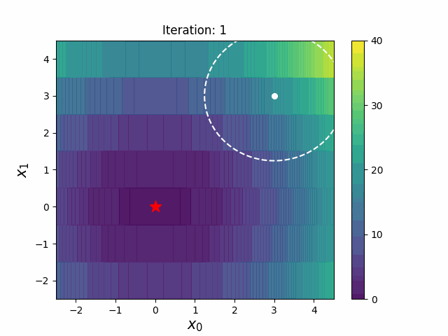

# CMA-ES with Margin

CMA-ES with Margin (CMA-ESwM) [1] is a CMA-ES variant proposed for mixed-integer black-box optimization, which introduces a lower bound on the marginal probability associated with integer variables.

## Demonstration

Here we show optimizing SphereInt function with CMA-ES and CMA-ESwM. The SphereInt function is given as follows (This is a minimization problem).
$$ f(x) = x_0^2 + x_1^2 \text{ , where } x_0 \in \mathbb{R}, x_1 \in \mathbb{Z} \text{.} $$

|CMA-ES|CMA-ESwM|
|---|---|
|||

The integer variable $x_0$ is obtained by rounding the continuous variable sampled from the multivariate normal distribution. The dashed ellipse represents the confidence ellipse of the multivariate normal distribution. The red star indicates the optimal solution position. The CMA-ES may not change the evaluation value because of the plateau caused by the discretization. On the other hand, the CMA-ESwM prevents this stagnation by keeping the probability of being sampled outside a plateau above a certain level.

## Usage

Please see `sample_script.py`.

<details>
<summary>Details (click to expand)</summary>

### Setting the objective function
Set the objective function, the number of dimensions, and the maximum number of evaluations. As an example, the SphereOneMax function is set here.
```
func = 'SphereOneMax'
dim = 40     # total number of dimensions
dim_bi = dim//2     # number of binary variables
max_evals = dim * 1e4
f = eval('f_mixed.' + func)(d=dim, bid=dim_bi, ind=0, max_eval=max_evals)
```

### Setting the discrete space
Set the search space for discrete variables. If the number of the elements of the discrete variable is different in each dimension, align the number of array elements by filling the tail with `nan`. For example, a three-dimensional discrete variable `[[1, 2], [1, 2, 3], [1, 2, 3, 4]]` is set as follows:
```
import numpy as np

discrete_space = np.full((3, 4), np.nan)
discrete_space[0, :2] = np.array([1, 2])
discrete_space[1, :3] = np.array([1, 2, 3])
discrete_space[2, :4] = np.array([1, 2, 3, 4])
# discrete_space
# [[  1.   2.  nan  nan]
#  [  1.   2.   3.  nan]
#  [  1.   2.   3.   4.]]
```
This implementation also allows assignment of discrete variables that are not consecutive integers, such as `[1, 2, 4]` and `[0.01, 0.1, 1]`.

### Setting the hyperparameter
Set the population size, weight function, and margin parameter. The margin parameter represents $ \alpha $ in [1] and its recommended value is $ 1/(N \lambda)$, where $N$ is the number of dimensions and $\lambda$ is the population size. When the margin parameter is `0`, the CMA-ESwM behaves equivalently to the CMA-ES in this implementation.
```
lam = cma.CMAParam.pop_size(dim)
w_func = weight.CMAWeightWithNegativeWeights(lam, dim, min_problem=f.minimization_problem)
margin = 1 / (dim * lam)
```

### Initialization of mean vector and step size
Appropriate initial values can be set depending on the number of dimensions of the objective function. In this implementation, the initial values of the mean vectors corresponding to continuous and integer variables are sampled from a uniform distribution.
```
init_m, init_sigma = f_mixed.initial_setting_for_gaussian(f)
```

### CSV data log
The log of the experiment can be output in CSV format.
```
result_folder = f'./output/'
path_name = result_folder + f'{func}/dim{dim}/'
output = logg.DataLogger(file_name='result.csv', path_name=path_name)
```
If you do not want the log to be output, set `None` to `logger` as follows at running the optimizer.
```
opt.run(samp, logger=None, verbose=True)
```

### Setting and running the optimizer
You can use IPOP restart strategy. If you want to use the restart, set the maximum number of restarts to `restart`. Otherwise, set `-1` to `restart`.
```
# optimizer
samp = sampler.Sampler(f, lam)
opt = cma.CMAESwM(dim, discrete_space, w_func, samp,
                       lam=lam, m=init_m, sigma=init_sigma,
                       margin=margin, restart=-1, minimal_eigenval=1e-30)

# run
result = opt.run(samp, logger=output, verbose=True)
```

</details>

## References and related papers
1. Ryoki Hamano, Shota Saito, Masahiro Nomura, and Shinichi Shirakawa, CMA-ES with Margin: Lower-Bounding Marginal Probability for Mixed-Integer Black-Box Optimization, In Genetic and Evolutionary Computation Conference (GECCO ’22), July 9–13, 2022, Boston, MA, USA. ACM, New York, NY, USA, 9 pages. https://doi.org/10.1145/3512290.3528827
2. Ryoki Hamano, Shota Saito, Masahiro Nomura, and Shinichi Shirakawa, Benchmarking CMA-ES with Margin on the bbob-mixint Testbed, In Genetic and Evolutionary Computation Conference Companion (GECCO ’22 Companion), July 9–13, 2022, Boston, MA, USA. ACM, New York, NY, USA, 9 pages. https://doi.org/10.1145/3520304.3534043
